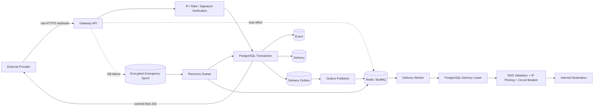
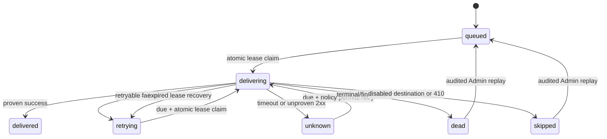

# Webhook Gateway v2.0.1 Architecture

## 1. Scope

Webhook Gateway is an independent inbound safety boundary. It receives public provider webhooks, verifies them, records durable delivery intent, and forwards normalized payloads to configured internal applications.

It does not own downstream business logic, payment state, provider account configuration, or destination application idempotency.

## 2. Five-stage structure

```text
Application -> System -> Component -> Feature -> Part
```

```text
src/application
  api.ts / worker.ts
  Thin launchers only.

src/system
  api-system.ts
  worker-system.ts
  Runtime composition and lifecycle.

src/component
  routing.ts
  delivery.ts
  Reusable orchestration and delivery policy.

src/feature
  config.ts
  db.ts
  queue.ts
  spool.ts
  verifiers.ts
  destination-http.ts
  composite-rate-limit.ts
  circuit-breaker.ts
  tgserver-log.ts
  Infrastructure-facing capabilities.

src/part
  env.ts
  crypto.ts
  types.ts
  http.ts
  normalizer.ts
  url-security.ts
  ip-allowlist.ts
  metrics.ts
  sanitize.ts
  clock.ts
  Pure primitives and policies.
```

The root `src/server.ts` and `src/worker.ts` files are Application entrypoints and contain no business logic.

## 3. Runtime topology



## 4. Ingress transaction

1. Resolve enabled source by `slug`.
2. Enforce source IP allowlist when configured.
3. Enforce provider and source-IP rate limits.
4. Preserve request body as bytes.
5. Verify provider signature against those exact bytes.
6. Require a stable provider event ID.
7. Normalize JSON or base64 raw data and build a CloudEvent.
8. Resolve enabled routes.
9. Start PostgreSQL transaction.
10. Insert Event with `(source_id, provider_event_id)` uniqueness.
11. Insert idempotent Delivery rows.
12. Insert one idempotent Delivery Outbox row for each new Delivery.
13. Commit.
14. Start best-effort deferred Redis enqueue.
15. Return `202`.

Redis is not part of the acknowledgement transaction. A Redis outage does not invalidate a committed provider acknowledgement.

## 5. Emergency durable path

If the PostgreSQL transaction fails:

1. Sanitize nonessential headers.
2. Preserve exact body, verification result, source identity, and CloudEvent.
3. Write a temporary spool file.
4. For `encrypted_file`, encrypt with AES-256-GCM and authenticate the canonical envelope with HMAC-SHA256.
5. Atomically rename the temporary file.
6. Return `202` only after the final spool file exists.

If DB and spool both fail, return `503`.

Recovery always reconciles Delivery and Outbox rows even when the Event already exists. This closes the partial-recovery window where a prior attempt inserted the Event and failed before routing was completed.

## 6. Delivery state and lease model



A delivery claim writes a random `lock_token` and `lock_expires_at`. Completion and failure updates require the same token. Duplicate BullMQ jobs therefore cannot concurrently own the same delivery.

The destination timeout must remain at least five seconds below the delivery lease. Startup validation rejects unsafe combinations.

## 7. Transactional outbox

`delivery_outbox` is the durable queue-publication ledger.

- New Delivery and Outbox rows share the ingress transaction.
- Publishers select due rows with `FOR UPDATE SKIP LOCKED`.
- Each claim receives a lock token and expiry.
- Successful BullMQ enqueue marks the row `published`.
- Failure marks it `failed` with a retry time.
- Expired `publishing` leases are reclaimable.

Direct deferred enqueue reduces latency; the Outbox guarantees reconstruction after process or Redis failure.

## 8. Destination network security

Before each dispatch:

1. Parse URL and permit only HTTP/HTTPS.
2. Reject embedded credentials and fragments.
3. Resolve all DNS answers.
4. Reject the destination when any answer is private, local, reserved, documentation-only, multicast, or otherwise non-routable unless `allowPrivateNetwork=true`.
5. Select an allowed address.
6. Pin Undici DNS lookup to that address for the connection.
7. Disable redirects.

This prevents validation/connection DNS rebinding. Internal Docker-service destinations require explicit `allowPrivateNetwork=true`.

## 9. Circuit breaker

Circuit state is stored in Redis per destination.

- Failures increment atomically.
- Threshold opens the circuit until `open_until`.
- After expiry, exactly one half-open probe obtains a short Redis lock.
- Success deletes circuit state.
- Failure reopens it.
- Redis failure degrades open: PostgreSQL retry policy remains authoritative and Redis cannot permanently block durable work.

## 10. Delivery outcome rules

- `successMode=status_only`: any 2xx is delivered.
- `successMode=status_and_header`: configured acceptance header is required.
- `unknownPolicy=treat_2xx_as_delivered`: 2xx is accepted without the proof header.
- Timeout: result is unknown because the receiver may have processed the request.
- 410: skipped and requires configuration/operator action.
- 429: retry using bounded `Retry-After` when supplied.
- 500/502/503/504: infrastructure retry.
- Other 4xx: dead unless client-error retry is enabled.
- Response bodies are bounded; excess data is truncated without changing HTTP success semantics.

## 11. Readiness semantics

`/healthz` confirms process liveness.

`/readyz` reports:

- PostgreSQL: required for normal durable ingress.
- Redis: not required for ingress; failure is reported as degraded delivery transport.
- Clock skew: required only when configured as required.
- Spool counts: operational visibility.

The API container does not depend on Redis health at startup. Worker startup does.

## 12. Replay and audit

Admin replay:

- requires token and optional IP allowlist;
- is rate limited;
- acquires a PostgreSQL cooldown atomically;
- resets eligible delivery state and lease fields;
- enqueues best effort;
- writes an audit record for accepted and rate-limited attempts.

No Admin endpoint mutates source, route, destination, or secret configuration.

## 13. Observability

- Prometheus metrics for ingress, rate limits, delivery outcomes, spool, clock skew, and TGServer logging.
- Structured sanitized console logs.
- Optional non-blocking TGServer log batching with bounded memory queue.
- PostgreSQL remains the authoritative operational ledger for Event, Delivery, Outbox, replay lock, and audit state.

## 14. Non-negotiable invariants

1. Never parse or trust provider payload before signature verification.
2. Never return `202` without a committed DB transaction or committed spool file.
3. Never make Redis the source of truth.
4. Never dispatch without a valid PostgreSQL delivery lease.
5. Never follow destination redirects.
6. Never accept an unvalidated runtime configuration.
7. Never expose spool contents or Admin endpoints publicly.
8. Never claim exactly-once delivery; downstream receivers must be idempotent.
